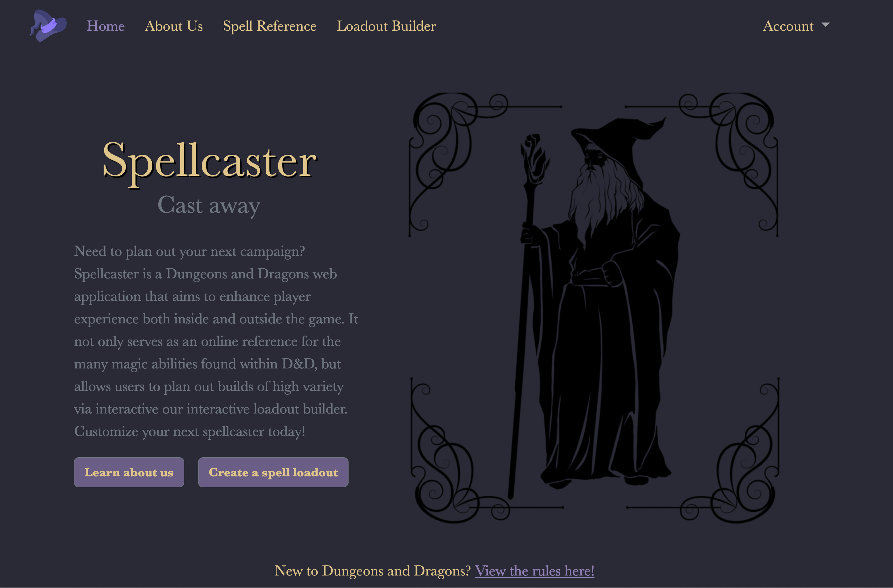

Run the app by running app.py

If the Database needs to be rebuilt:
    - run build_spells_db.py (this may take a while)
    - launch sqlite by calling: sqlite3 spellcaster.db
    - copy and paste these commands into the terminal:
    
        CREATE TABLE users (
            user_id INTEGER PRIMARY KEY,
            username TEXT NOT NULL,
            encrypted_password TEXT NOT NULL
        );

        CREATE TABLE loadouts (
            loadout_id INTEGER PRIMARY KEY,	
            user_id INTEGER,			
            loadout_name TEXT NOT NULL,		
            class TEXT NOT NULL,		
            description TEXT,			
            spell_name TEXT NOT NULL
        );
        .quit
